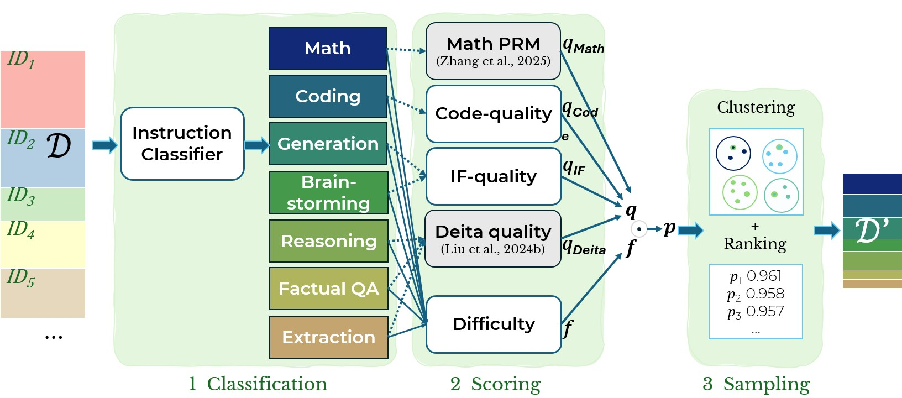

# LASER: Label-Aware Scoring and clustERing 

This repository contains the code to run the LASER data selection pipeline and scripts to replicate the experiment of our *EMNLP 2025 Findings* paper [[link](https://arxiv.org/abs/2505.22157)].

The LASER pipeline enables you to select the best composition of instruction tuning datapoints from a large pool of source data.
LASER has 3 steps: Use a light-weight classifer (Step 1) to route data to specialized scorers (Step 2) and subsequently sample in a diversity aware fashion (Step 3; see illustration below).


## Motivation

- Studies show post-training **(instruction tuning) datasets** for LLMs can be substantially down-sampled **without deteriorating performance**. ​

- However, **Instruction Data (ID) selection** often incurs <span style="color:red">high computational costs</span> or is <span style="color:red">limited to narrow domains</span>.​

- In this work, we demonstrate that data selection can be both—**efficient and universal**—by using a multi-step pipeline, <span style="color:teal">**LASER**</span>.​


## Setup
### Install dependencies

To run the LASER pipeline, you will have to install its dependencies. We recommend creating a virtual environment via
```bash
python -m venv laser-env
source laser-env/bin/activate
pip install -r requirements.txt
```

### Download datasets
The data from our experiments can be downloaded to `data/` and preprocessed by running the following script: 
```bash
python data/download_data.py
```
LASER can also be used with any custom instruction tuning data. Note that data should be stored in `data/` and follow either **conversational json**...

```json
{
  "messages": [
    {"role": "user", "content": "<instruction>"},
    {"role": "assistant", "content": "<response>"}
  ],
  "data_id": "<unique_string>"
}
```
...or **instruction - output** format.

```json
{
  "instruction":  "<instruction>",
  "output":       "<response>",
  "data_id":      "<unique_string>"
}
```
Data must be saved as a `.jsonl` file.

## Step 1 & 2: Classification & Scoring

In **Step 1 and 2** of the LASER pipeline, we analyse every sample for its domain as well as its quality and difficulty. You can run the analysis pipeline as shown below.

```bash
cd analysis
python -m run_analysis --analysis <type_analysis> --dataset <name_dataset>
```

Please check the documentation in the [README.md](./analysis/README.md) in the analysis subdirectory for additional details.

## Step 3: Sampling
In **Step 3**, we integrate the results from Step 1 and 2 to then sample in a diversity-aware way. To run the sampling pipeline, you have to specify a `dataset_config` and then run the sampling with it. 

### Specify sampling configurations
Store the configs `.yaml`-file for your sampling in `dataset_mixer/dataset_configs/`. To sample at random from `alpaca_gpt4`, `flan_v2_90k` and `sharegpt_en`, you can define:
```yaml
test_random:
  scoring_strategy: random
  sample_size: 10000
  data:
    - name: alpaca_gpt4
      data_path: DATA_PATH/alpaca_gpt4.jsonl
      type: self_instruct
      multi_turn: True
      language: en

    - name: flan_v2_90k
      data_path: DATA_PATH/flan_v2_90k.jsonl
      type: self_instruct
      multi_turn: True
      language: en

    - name: sharegpt_en
      data_path: DATA_PATH/sharegpt_en.jsonl
      type: chat
      multi_turn: True
      language: en
```
Find more examples in the `dataset_mixer/dataset_configs/` subdirectory.

### Run sampling
Execute the following to run a single sampling run...

```bash
cd dataset_mixer/
python finetuning_data_mixer.py --config test_random.yaml
```

...or add multiple configs to the `DATASET_CONFIGS=` in `scripts/sample_data.sh` and run:
```bash
bash scripts/sample_data.sh
```


### Replicate EMNLP'25 Experiments
To replicate all of the experiments that we ran in the context of our EMNLP paper, please check `scripts/list_of_emnlp25_experiments.sh`


## Citation

If you find this project is useful in your own work, please consider citing as follows:

```
@article{mirza2025stratified,
  title={LASER: Stratified Selective Sampling for Instruction Tuning with Dedicated Scoring Strategy},
  author={Mirza, Paramita and Weber, Lucas and K{\"u}ch, Fabian},
  journal={arXiv preprint arXiv:2505.22157},
  year={2025}
}
```
