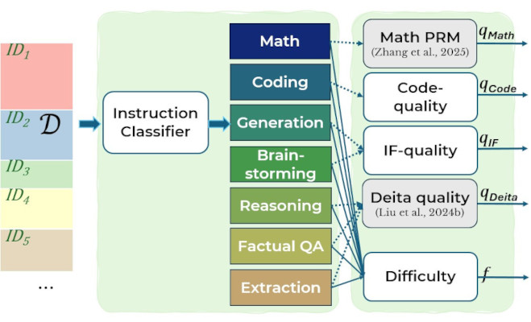

# LASER-analysis: A Repository for Analyzing Instructions




This repository contains the code for analyzing instruction datasets.

- We use [SetFit](https://github.com/huggingface/setfit) for efficient few-shot learning with Sentence Transformers
for classifying instructions into 7 categories: [Math, Coding, Generation, Brainstorming, Reasoning, Factual QA, Extraction]. We construct the training and validation data by sampling ~250 samples per category. 
Evaluated on the validation split, the classifier gets 96% macro F1-score.
- We use [Deita complexity scorer](https://huggingface.co/hkust-nlp/deita-complexity-scorer) and 
[Deita quality scorer](https://huggingface.co/hkust-nlp/deita-quality-scorer) for scoring (instruction) complexity and 
(response) quality w.r.t a given instruction
- We use a [Process Reward Model (PRM)](https://huggingface.co/Qwen/Qwen2.5-Math-PRM-7B) to score responses to math problems, in terms of reasoning steps.
- We use our custom IF-Quality scorer (based on [Qwen/Qwen3-14B](https://huggingface.co/Qwen/Qwen3-14B)) to score how well a response adheres to constraints given by an instruction.
- We use our custom Code-Quality scorer (based on [Qwen/Qwen3-14B](https://huggingface.co/Qwen/Qwen3-14B)) to score the quality of a code-related response to a given instruction.
- We use our custom [difficulty scorer](https://huggingface.co/IIS-NLP-internal/qwen3-8B-difficulty-scorer-v2) to score how challenging given instructions are.
- We use [vllm](https://github.com/vllm-project/vllm) for faster inference

### Running Analysis

#### Prerequisites

1. Create a virtual environment ``python -m venv analysis-env`` then activate `source analysis-env/bin/activate`
2. Install the dependencies with ``pip install -r requirements.txt``

#### Running Instruction Classification

1. Activate the analysis environment: `source analysis-env/bin/activate`.
2. Run classifier e.g.,
```bash
ANALYSIS_DIR=./
python -m run_analysis --analysis categories_v2 --dataset alpaca_gpt4,flan_v2_90k --output_dir ANALYSIS_DIR
```
3. The categories will be saved in ``ANALYSIS_DIR/categories_v2/``.

#### Running Instruction/Response Scoring

```bash
### Available ANALYSIS_TYPE for scoring
# if_quality,code_quality,process_reward_modelling,difficulty_v2,complexity,quality,tokens
```

1. Activate the analysis environment: `source analysis-env/bin/activate`.
2. Run scorer e.g.,
```bash
ANALYSIS_DIR=./
ANALYSIS_TYPE=if_quality
python -m run_analysis --analysis ANALYSIS_TYPE --dataset alpaca_gpt4,flan_v2_90k --output_dir ANALYSIS_DIR
```
3. The scores will be saved in ``ANALYSIS_DIR/ANALYSIS_TYPE_scores/``.


#### Add a new dataset to be analyzed
Add a dataset as a Tuple in ``utils.py`` to the `single_turn_jsonl_dataset` (when dataset-format
follows ("instruction", \[optional: "input"], "output")) or to `multi_turn_jsonl_dataset`
(when dataset-format follows chat format ("messages")):
```python
# Datasets that are registered (format: "instruction", [optional: "input"], "output")
single_turn_jsonl_dataset = [
    # (dataset-name,        pretty-name,   data location),
    ("open_math_instruct",  "MATH",        "open_math_instruct.jsonl"),
]

# Datasets that are registered (format: "messages")
multi_turn_jsonl_dataset = [
    # (dataset-name,   pretty-name,    data location,        kwargs),
    ("flan_v2_90k",    "Flan V2 90k",  "flan_v2_90k.jsonl",  None),
...
]
```


